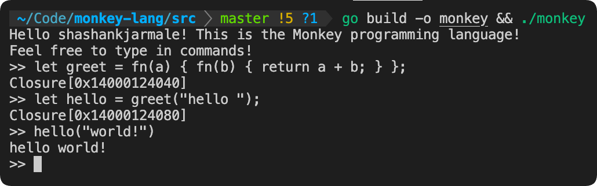

[](https://golang.org/dl/)

# monkey-lang

Monkey Programming Language, Interpreter, Compiler, & Virtual Machine written in Go. Inspired by [Writing An Interpreter in Go](https://interpreterbook.com/) & [Writing a Compiler in Go](https://compilerbook.com/) by [Thorsten Ball](https://thorstenball.com/).

I'm actively extending this language implementation with new features, for which I have many [ideas](IDEAS.md).

## The Monkey Programming Language

Monkey is a programming language designed to help teach programming language theory & design, interpreters, and compilers.


Read more about Monkey at the [official site](https://monkeylang.org/).

## Usage

To use the Monkey REPL, run:

```
go build -o monkey && ./monkey
```

By default, this runs the Monkey compiler & virtual machine, with entrypoint `main.go` into `repl/repl.go`. The `StartInterpreter` function can be used to instead spin up the interpreter-driven REPL.

## Benchmarks

The `benchmark/` directory implements a Fibonacci benchmark of the interpreter/evaluator & compiler/VM engines. To generate the benchmarking binary:

```
go build -o fibonacci-benchmark ./benchmark
```

To run the benchmark binary on each engine:

```
./fibonacci-benchmark -engine=eval
```

```
./fibonacci-benchmark -engine=vm
```

The tree-walking interpreter/evaluator engine took 9.004286 seconds for completion on average. The compiler/VM engine took 2.879004 seconds for completion on average, so it is roughly 3.13 times faster.

## Implementation Details

## Interpreter & Evaluator

The first implementation of Monkey relies on a tree-walking interpreter. In order, the stages are reading input, lexing (tokenization), parsing into an abstract syntax tree (AST), evaluation by traversing the nodes of the AST, and printing output.

## Compiler & Virtual Machine

The more advanced implementation of Monkey relies on a compiler & virtual machine. In order, the stages are reading input, lexing (tokenization), parsing into an AST, traversing the AST to compile it into a flat series of bytecode instructions, running the VM on the bytecode, and printing output. 

## Language Documentation

### Table of Contents

- [Summary](#summary)
- [Integers \& Arithmetic Operations](#integers--arithmetic-operations)
- [Booleans](#booleans)
- [Comparison Operators](#comparison-operators)
- [Conditionals](#conditionals)
- [Bindings](#bindings)
- [Strings](#strings)
- [Arrays](#arrays)
- [Hashmaps](#hashmaps)
- [Functions](#functions)
- [Built-In Functions](#built-in-functions)
    - [len](#len)
    - [puts](#puts)
    - [first](#first)
    - [last](#last)
    - [rest](#rest)
    - [append](#append)

### Summary

- Syntax inspired by JavaScript, Python, and C
- Primitives: integers, booleans, strings
- Arrays, hashmaps
- Prefix-, infix-, and index operators
- Global & local bindings
- First-class & higher-order functions
- Built-in functions
- Closures
- Recursion

### Integers & Arithmetic Operations

The basic arithmetic operations (`+`, `-`, `*`, `/`) are supported for integers. Floating-point numbers are not yet implemented.

```
3 + (10 * 2) - (8 / -4);
```

### Booleans

```
true;
false;

!true;
!false;
```

### Comparison Operators

The comparison operators `==`, `!=`, `<`, and `>` are supported. `<=` and `>=` are not yet implemented.

```
2 + 2 == 2 * 2;
3 != 1;
4 < 5;
-4 > -6;

"hello" == "hello";
"hello" != "world";
```

### Conditionals

`if` statements with optional `else` clauses are supported. `else if` blocks are not yet implemented.

```
if (3 == 2 + 1) {
    27;
} else {
    9;
}
```

### Bindings

Bindings in Monkey can be defined using the `let` keyword. `const` declarations, as in JavaScript, are not yet supported.

```
let a = 3;
let b = a;
let c = a + b;
```

### Strings

Strings can be added with `+`. More complex operations for strings, such as comparison with `==` / `!=` and `split`, are not yet implemented.

```
"This is the Monkey programming language!";
"Hello " + "world!";
```

### Arrays

As Monkey has a purely dynamic type system, arrays can contain elements of different types. The index operator is used to access elements from within an array.

```
let a = [1, true, "hi there", 16 - 32, [9, false]];
a[2];
a[4][1];
```

### Hashmaps

The hashable data types in Monkey are integers, booleans, and strings, so these are the data types that can be used as keys in hashmaps. Values of any type can be used as values in hashmaps. The index operator is used to access key-value pairings based on the key. When a key is not found in a hashmap, the index operation returns `null`.

```
let h = {
    "k": "v",
    14: false,
    true: 16 + 8,
};

h["k"];
h[14];
h[true];

h["not-found"] // null
```

### Functions

Functions are declared using the `fn` keyword. Function literals can be defined and called without being bound to names:

```
fn(x) {
    x;
}(20);
```

Functions in Monkey are first-class and higher-order functions are supported, meaning that an arbitrary function literal can be treated like any other data type: bound to identifiers, passed around, etc.

```
let add = fn(a, b) {
    return a + b;
};
let sum = add(10, 15);

let f = fn(x) {
    x * 2;
};
let g = fn(x) {
    x - 5;
};
let compose = fn(f, g, x) {
    f(g(x));
};
compose(f, g, 20)
```

As can be seen from the function examples above, both implicit (value of last-evaluated expression) and explicit (using `return` keyword) returns are supported.

Closures, as well as recursion, are also supported. In fact, all Monkey functions are (internally) treated as closures, since for practical purposes a function that closes over the empty set as its environment is just a closure with no free variables.

```
let newAdder = fn(a, b) {
    fn(c) { a + b + c };
};
let adder = newAdder(1, 2);
adder(8); // 11
```

```
let fibonacci = fn(x) {
    if (x == 0) {
        return 0;
    } else {
        if (x == 1) {
            return 1;
        } else {
            fibonacci(x - 1) + fibonacci(x - 2);
        }
    }
};
fibonacci(15); // 610
```

### Built-In Functions

There are several built-in functions within this implementation, with more to be added soon.

#### len

Calculates the number of characters in the provided string or the number of elements in the provided array.

```
len("Hello world!");
len([1, 2, 3]);
```

#### puts

Prints the specified value to `STDOUT`. Monkey's equivalent of `print` or `console.log`.

```
puts("Hello world!");
puts(1 + 4 + 7);
puts([4, 7, 9]);
```

#### first

Returns the first element in the provided array.

```
let a = [1, 2, 3];
let firstElem = first(a); // 1

let b = [];
first(b); // ERROR
```

#### last

Returns the last element in the provided array.

```
let a = [1, 2, 3];
let lastElem = last(a); // 3

let b = [];
last(b); // ERROR
```

#### rest

Returns an array containing all elements in the provided array except for the first one.

```
let a = [1, 2, 3];
rest(a); // [2, 3]

let b = [1];
rest(b); // []

let c = [];
rest(c); // null
```

#### append

Expects the first provided argument to be an array, and the second to be of any Monkey data type. Returns a new array with all the elements of the provided array and the specified element at the end.

```
let a = [1, 2];
let b = append(a, 3); // [1, 2, 3]
let c = append(a, fn(x) { x; }); // [1, 2, fn(x) { x; }]
```
