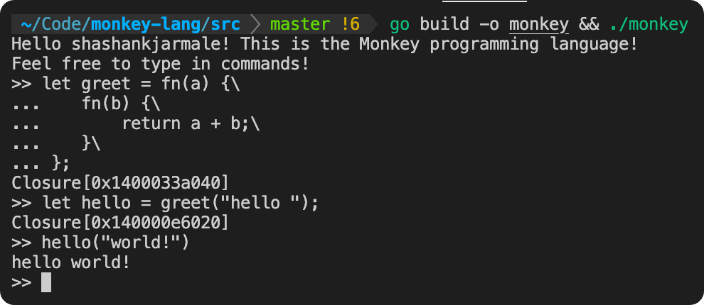
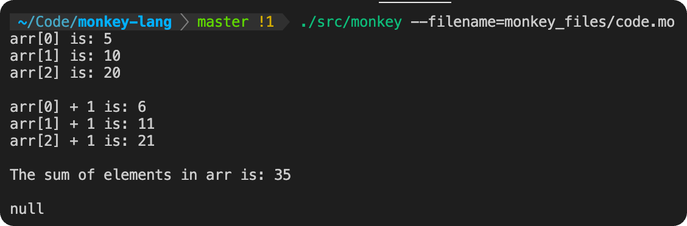

[](https://golang.org/dl/)

# monkey-lang

Monkey Programming Language, Interpreter, Compiler, & Virtual Machine written in Go. Inspired by [Writing An Interpreter in Go](https://interpreterbook.com/) & [Writing a Compiler in Go](https://compilerbook.com/) by [Thorsten Ball](https://thorstenball.com/).

I'm actively extending this language implementation with new features, for which I have many [ideas](IDEAS.md).

## The Monkey Programming Language

Monkey is a programming language designed to help teach programming language theory & design, interpreters, and compilers.


Read more about Monkey at the [official site](https://monkeylang.org/).

## Usage

### REPL

To use the Monkey REPL, run the below command from within the `src` directory. By default, this runs the Monkey compiler & virtual machine, with entrypoint `main.go` into `repl/repl.go`.

```
go build -o monkey && ./monkey
```

<p align="center">
    
</p>

The REPL has some ergonomic features, courtesy of the `chzyer/readline` package:

- Multi-line input, which can be done by placing a backslash `\` at the end of each line which should be continued onto the next prior to the REPL processing the input
- Maintained history of past input, which can be navigated via the up and down arrow keys
- Navigating back-and-forth within REPL input via the left and right arrow keys
- Closing REPL via `Ctrl+D` or the `exit` command
- Input interrupt via `Ctrl+C`

The engine can be specified via a command-line argument if you want to use the interpreter/evaluator engine instead:

```
go build -o monkey && ./monkey -engine=eval
```

<p align="center">
    
</p>

Note that the features listed in this document are all supported in the compiler/VM engine, but the interpreter/evaluator implementation may not be fully up-to-date.

### Files

This implementation also supports running Monkey code written in files. The file can be named and use whatever extension you want, but I like using the `.mo` extension. There are a couple of example Monkey files in the `./monkey_files` directory. To run a file, pass its path to the Monkey binary with the `filename` command-line argument. For example, once the Monkey binary is built with the above command, the following command (run from the root directory of this repo) runs `./monkey_files/code.mo`:

```
./src/monkey --filename=monkey_files/code.mo
```

Note that files can currently only be run via the compiler/VM engine.

## Table of Contents

- [monkey-lang](#monkey-lang)
  - [The Monkey Programming Language](#the-monkey-programming-language)
  - [Usage](#usage)
    - [REPL](#repl)
    - [Files](#files)
  - [Table of Contents](#table-of-contents)
  - [Benchmarks](#benchmarks)
  - [Implementation Details](#implementation-details)
    - [Interpreter \& Evaluator](#interpreter--evaluator)
    - [Compiler \& Virtual Machine](#compiler--virtual-machine)
  - [Language Documentation](#language-documentation)
    - [Summary](#summary)
    - [Integers, Floats, and Arithmetic Operations](#integers-floats-and-arithmetic-operations)
    - [Booleans](#booleans)
    - [Comparison Operators](#comparison-operators)
    - [Conditionals](#conditionals)
    - [Loops](#loops)
    - [Bindings](#bindings)
    - [Postfix Operators](#postfix-operators)
    - [Strings](#strings)
    - [Arrays](#arrays)
    - [Hashmaps](#hashmaps)
    - [Functions](#functions)
    - [Built-In Functions](#built-in-functions)
      - [puts](#puts)
      - [len](#len)
      - [first](#first)
      - [last](#last)
      - [rest](#rest)
      - [append](#append)
      - [join](#join)
      - [split](#split)
      - [sum](#sum)

## Benchmarks

The `benchmark/` directory implements some benchmarks of the interpreter/evaluator & compiler/VM engines. To generate the benchmarking binary:

```
go build -o benchmark-binary ./benchmark
```

To run the benchmark binary on each engine:

```
./benchmark-binary -engine=eval
```

```
./benchmark-binary -engine=vm
```

The tree-walking interpreter/evaluator engine took 9.004286 seconds for completion on average. The compiler/VM engine took 2.879004 seconds for completion on average, so it is roughly 3.13 times faster.

## Implementation Details

### Interpreter & Evaluator

The first implementation of Monkey relies on a tree-walking interpreter. In order, the stages are reading input, lexing (tokenization), parsing into an abstract syntax tree (AST), evaluation by traversing the nodes of the AST, and printing output.

### Compiler & Virtual Machine

The more advanced implementation of Monkey relies on a compiler & virtual machine. In order, the stages are reading input, lexing (tokenization), parsing into an AST, traversing the AST to compile it into a flat series of bytecode instructions, running the VM on the bytecode, and printing output. 

## Language Documentation

### Summary

- Syntax inspired by JavaScript, Python, and C
- Primitives: integers, floats, booleans, strings
- Global & local bindings
- Conditionals
- Loops
- Arrays, hashmaps
- Prefix-, infix-, postfix-, and index operators
- First-class & higher-order functions
- Built-in functions
- Closures
- Recursion

### Integers, Floats, and Arithmetic Operations

The basic arithmetic operations (`+`, `-`, `*`, `/`, `//`) are supported for integers and floats (both 64 bits). The modulus operator `%` is also supported. Operations involving an integer and a float will produce a float, and division between two integers may produce either an integer or a float. Note that both regular division and integer division are supported.

The `**` operator for exponentiation is supported.

```
3 + (10 * 2) - (8 / -4);
22 // 7;
5 % 3;
3.87 + 4 * 6.1;
2**3;
```

Additionally, shorthand assignment syntax for each of the basic arithmetic operations is supported. This is done using the tokens `+=`, `-=`, `*=`, `/=`, and `//=`, which perform the respective operation between the identifier on the left and the expression on the right and then reassign that value to the identifier.

```
let x = 5;
x += 10; // `x` is now 15
```

### Booleans

The bang operator `!` and the logical boolean operators `&&` and `||` are supported.

```
true;
false;

!true;
!false;

true && true;
false || true;
```

### Comparison Operators

The comparison operators `==`, `!=`, `<`, `>`, `<=`, and `>=` are supported.

```
2 + 2 == 2 * 2;
3 != 1;
4 < 5;
-4 > -6;
16 <= 42;
89 >= 89;

"hello" == "hello";
"hello" != "world";
```

### Conditionals

`if` statements with optional `else if` and `else` clauses are supported. As many `else if` clauses as desired can be used.

```
if (x > 3) {
    27;
} else if (x == 3) {
    -14;
} else {
    9;
}
```

Additionally, `switch` statements with an arbitrary number (at least one) of `case`s and an optional `default` case are supported. Truth checking for `case`s is done via the `==` equality operator between the `switch` expression and the `case` expression. Note that only the first applicable case, if any, is executed, and then the `switch` statement terminates.

```
switch x {
case "hello":
    puts("hello");
case "world":
    puts("world");
default:
    puts("hello world");
}
```

### Loops

`while` loops with a conditional clause and a body block statement are supported.

```
let arr = [1, 2, 3];
let i = 0;
while (i < len(arr)) {
    puts(arr[i]);
    i = i + 1;
}
```

`for` loops with an initialization statement, a condition, an afterthought statement, and a body block statement are supported.

```
let arr = [1, 2, 3];
for (let i = 0; i < len(arr); i = i + 1) {
    puts(arr[i]);
}
```

### Bindings

Bindings in Monkey can be defined using the `let` keyword. Once a variable with a given name has been declared using `let`, its value can be reassigned using a naked assign statement, as shown below. Note that a variable binding's value can only be reassigned in the same scope in which it was originally declared.

`const` declarations, as in JavaScript, are also supported. If a binding is declared using the `const` keyword, its value may not be reassigned later.

```
let a = 3;
a = a + 1; // Legal reassignment

let b = a;
let c = a + b;

d = b + c; // Illegal assignment (`d` has not been declared - compile-time error)

const e = 50;
e = 40; // Illegal reassignment (`e` is a const)
```

### Postfix Operators

The postfix operators `++` and `--` are supported for incrementing and decrementing, respectively, values bound to identifiers.

```
let i = 0;
i++;
i--;
```

### Strings

Strings can be added with `+`. More complex operations for strings, such as comparison with `==` / `!=` and `split`, are not yet implemented.

```
"This is the Monkey programming language!";
"Hello " + "world!";
```

### Arrays

As Monkey has a purely dynamic type system, arrays can contain elements of different types. The index operator is used to access elements from within an array. Arrays can also be added using the `+` operator.

```
let a = [1, true, "hi there", 16 - 32, [9, false]];
a[2];
a[4][1];
let b = a + [1, 4] + [true, "bye"];
```

### Hashmaps

The hashable data types in Monkey are integers, booleans, and strings, so these are the data types that can be used as keys in hashmaps. Note that floats are not hashable in this implementation and therefore cannot be used as hashmap keys. Values of any type can be used as values in hashmaps. The index operator is used to access key-value pairings based on the key. When a key is not found in a hashmap, the index operation returns `null`.

```
let h = {
    "k": "v",
    14: false,
    true: 16 + 8,
};

h["k"];
h[14];
h[true];

h["not-found"] // null
```

### Functions

Functions are declared using the `fn` keyword. Function literals can be defined and called without being bound to names:

```
fn(x) {
    x;
}(20);
```

Functions in Monkey are first-class and higher-order functions are supported, meaning that an arbitrary function literal can be treated like any other data type: bound to identifiers, passed around, etc.

```
let add = fn(a, b) {
    return a + b;
};
let sum = add(10, 15);

let f = fn(x) {
    x * 2;
};
let g = fn(x) {
    x - 5;
};
let compose = fn(f, g, x) {
    f(g(x));
};
compose(f, g, 20)
```

As can be seen from the function examples above, both implicit (value of last-evaluated expression) and explicit (using `return` keyword) returns are supported.

Closures, as well as recursion, are also supported. In fact, all Monkey functions are (internally) treated as closures, since for practical purposes a function that closes over the empty set as its environment is just a closure with no free variables.

```
let newAdder = fn(a, b) {
    fn(c) { a + b + c };
};
let adder = newAdder(1, 2);
adder(8); // 11
```

```
let fibonacci = fn(x) {
    if (x == 0) {
        return 0;
    } else {
        if (x == 1) {
            return 1;
        } else {
            fibonacci(x - 1) + fibonacci(x - 2);
        }
    }
};
fibonacci(15); // 610
```

### Built-In Functions

There are several built-in functions within this implementation, with more to be added soon.

#### puts

Prints the specified value to `STDOUT`. Monkey's equivalent of `print` or `console.log`.

```
puts("Hello world!");
puts(1 + 4 + 7);
puts([4, 7, 9]);
```

#### len

Calculates the number of characters in the provided string, the number of elements in the provided array, or the number of key-value pairs in the provided hashmap.

```
len("Hello world!");
len([1, 2, 3]);
len({1: 2, "hi": "there", true: false});
```

#### first

Returns the first element in the provided array.

```
let a = [1, 2, 3];
let firstElem = first(a); // 1

let b = [];
first(b); // ERROR
```

#### last

Returns the last element in the provided array.

```
let a = [1, 2, 3];
let lastElem = last(a); // 3

let b = [];
last(b); // ERROR
```

#### rest

Returns an array containing all elements in the provided array except for the first one.

```
let a = [1, 2, 3];
rest(a); // [2, 3]

let b = [1];
rest(b); // []

let c = [];
rest(c); // null
```

#### append

Expects the first provided argument to be an array, and the second to be of any Monkey data type. Returns a new array with all the elements of the provided array and the specified element at the end.

```
let a = [1, 2];
let b = append(a, 3); // [1, 2, 3]
let c = append(a, fn(x) { x; }); // [1, 2, fn(x) { x; }]
```

#### join

Joins the elements of the provided array into a single string with some delimiter if one is provided. All array elements must themselves be strings, and the delimiter must be a string.

```
join(["hello", " world", "!"]); // "hello world!"
join(["i", "am", "here"], " "); // "i am here"
join(["1", "2", "3"], ", "); // "1, 2, 3"
```

#### split

Splits the characters of the provided string into substrings separated by the provided separator string, if one is provided. If a separator is not provided, the string is split into individual characters. An array of the resulting substrings is returned.

```
split("hello"); // ["h", "e", "l", "l", "o"]
split("hello world", " "); // ["hello", "world"]
```

#### sum

Returns the numerical sum of the elements in the provided array.

```
let a = [1, 2, 3];
let aSum = sum(a); // 6
```
